# Docker Basics

## Initial Setup

Open [https://labs.play-with-docker.com](https://labs.play-with-docker.com) in your preferred browser

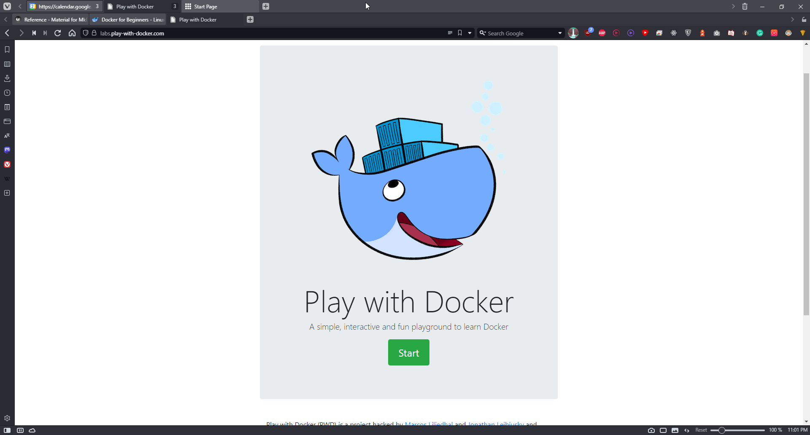


Click Start

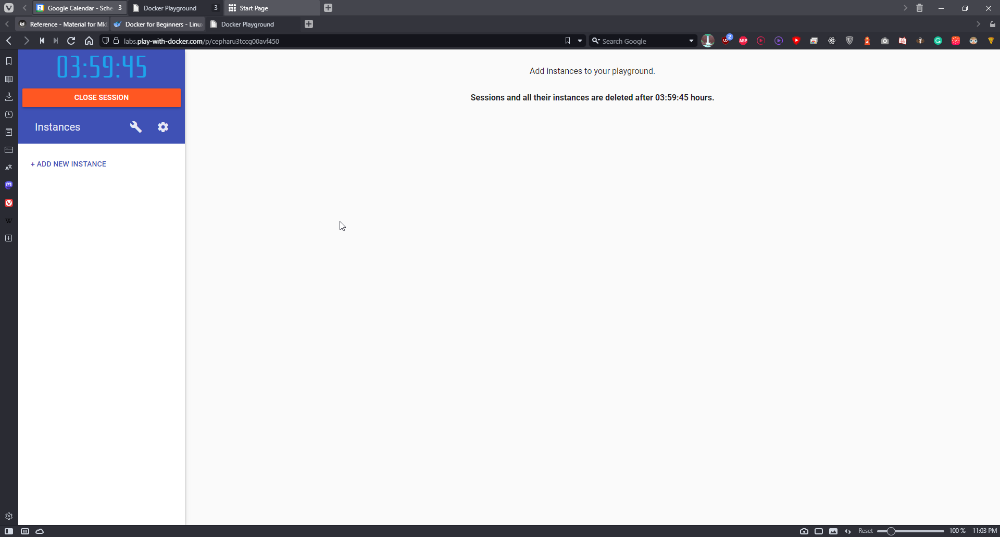

Click on Add New Instance

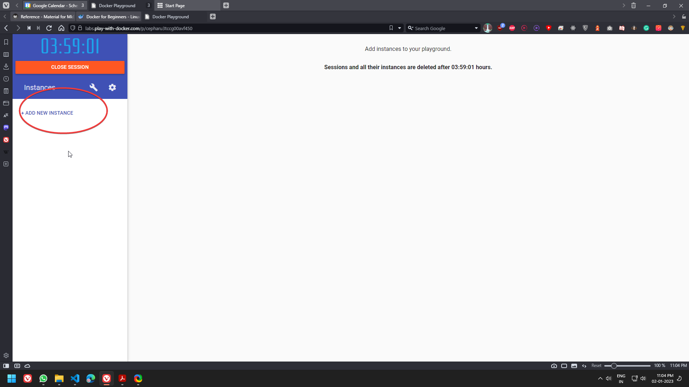

If you see this You are now succesfully controlling your own temporary machine with alpine Linux and docker

!!! info
    Alpine Linux is a Linux distribution designed to be small, simple and secure


## Run some simple Docker containers

There are different ways to use containers. These include:

1. **To run a single task:** This could be a shell script or a custom app.
2. **Interactively:** This connects you to the container similar to the way you SSH into a remote server.
3. **In the background:** For long-running services like websites and databases.

In this section you'll try each of those options and see how Docker manages the workload.

### Run a single task in an Alpine Linux container

- In this step we're going to start a new container
- tell it to run the `hostname` command. 
- The container will start, execute the `hostname` command, then exit.

- Run the following command in your Linux console.

```.term1
docker container run alpine hostname
```

- The output below shows that the `alpine:latest` image could not be found locally.
- When this happens, Docker automatically *pulls* it from Docker Hub.

- After the image is pulled, the container's hostname is displayed (d161753ccebf in the example below).

- 


- Docker keeps a container running as long as the process it started inside the container is still running.
- In this case the `hostname` process exits as soon as the output is written. - This means the container stops.
- However, Docker doesn't delete resources by default, so the container still exists in the `Exited` state.

- List all containers.

```.term1
docker container ls --all
```

- Notice that your Alpine Linux container is in the `Exited` state.


    > **Note:** The container ID *is* the hostname that the container displayed. In the example above it's `d161753ccebf`.

- Containers which do one task and then exit can be very useful.
- You could build a Docker image that executes a script to configure something.
- Anyone can execute that task just by running the container - they don't need the actual scripts or configuration information.

### Run an interactive Ubuntu container

- You can run a container based on a different version of Linux than is running on your Docker host.

- In the next example, we are going to run an **Ubuntu Linux** container on top of an Alpine Linux Docker host (Play With Docker uses Alpine Linux for its nodes).

- Run a Docker container and access its shell.

    ```.term1
    docker container run --interactive --tty --rm ubuntu bash
    ```


- In this example, we're giving Docker three parameters:

    * `--interactive` says you want an interactive session.
    * `--tty` allocates a pseudo-tty.
    * `--rm` tells Docker to go ahead and remove the container when it's done executing.

!!! info
    A tty is essentially a text input output environment i.e basically a shell.


- The first two parameters allow you to interact with the Docker container.

- We're also telling the container to run `bash` as its main process (PID 1).

- When the container starts you'll drop into the bash shell with the default prompt `root@<container id>:/#`.

- Docker has attached to the shell in the container, relaying input and output between your local session and the shell session in the container.

- Run the following commands in the container.

- `ls /` will list the contents of the root directory in the container
- `ps aux` will show running processes in the container
- `cat /etc/issue` will show which Linux distro the container is running, in this case Ubuntu 20.04.3 LTS.

   ```.term1
   ls /
   ```

   ```.term1
   ps aux
   ```

   ```.term1
   cat /etc/issue
   ```


- Type ```exit``` to leave the shell session.
- This will terminate the `bash` process, causing the container to exit.

    ```.term1
    exit
    ```

    > **Note:** As we used the `--rm` flag when we started the container, Docker removed the container when it stopped. This means if you run another `docker container ls --all` you won't see the Ubuntu container.

- For fun, let's check the version of our host VM.

    ```.term1
    cat /etc/issue
    ```

- You should see:

   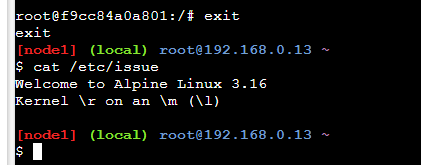


- Notice that our host VM is running Alpine Linux,
- yet we were able to run an Ubuntu container. 
- As previously mentioned, the distribution of Linux inside the container does not need to match the distribution of Linux running on the Docker host.

- However, Linux containers require the Docker host to be running a Linux kernel.
- For example, Linux containers cannot run directly on Windows Docker hosts.
- The same is true of Windows containers 
- they need to run on a Docker host with a Windows kernel.

- Interactive containers are useful when you are putting together your own image.
- You can run a container and verify all the steps you need to deploy your app, and capture them in a Dockerfile.

> You *can* [commit](https://docs.docker.com/engine/reference/commandline/commit/) a container to make an image from it - but you should avoid that wherever possible. It's much better to use a repeatable [Dockerfile](https://docs.docker.com/engine/reference/builder/) to build your image. You'll see that shortly.


### Run a background MySQL container

Background containers are how you'll run most applications. Here's a simple example using MySQL.

- Run a new MySQL container with the following command.

    ```.term1
    docker container run \
    --detach \
    --name mydb \
    -e MYSQL_ROOT_PASSWORD=my-secret-pw \
    mysql:latest
    ```

    * `--detach` will run the container in the background.
    * `--name` will name it **mydb**.
    * `-e` will use an environment variable to specify the root password (NOTE: This should never be done in production).

    As the MySQL image was not available locally, Docker automatically pulled it from Docker Hub.

   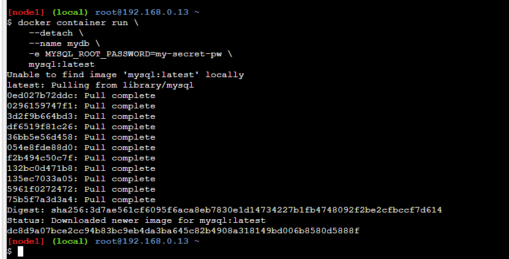


- As long as the MySQL process is running, Docker will keep the container running in the background.

- List the running containers.

    ```.term1
    docker container ls
    ```

    Notice your container is running.


- You can check what's happening in your containers by using a couple of built-in Docker commands: `docker container logs` and `docker container top`.

    ```.term1
    docker container logs mydb
    ```

    This shows the logs from the MySQL Docker container.

   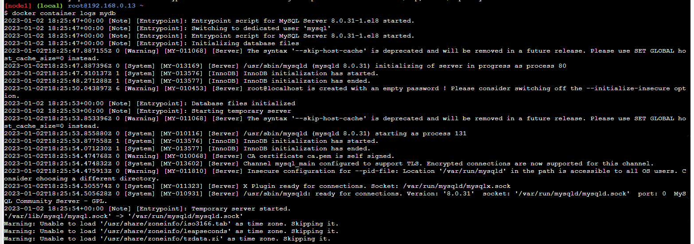

      Let's look at the processes running inside the container.

    ```.term1
      docker container top mydb
    ```

    You should see the MySQL daemon (`mysqld`) is running in the container.


- Although MySQL is running, it is isolated within the container because no network ports have been published to the host. 
- Network traffic cannot reach containers from the host unless ports are explicitly published.

- List the MySQL version using `docker container exec`.

- `docker container exec` allows you to run a command inside a container.
- In this example, we'll use `docker container exec` to run the command-line equivalent of `mysql --user=root --password=$MYSQL_ROOT_PASSWORD --version` inside our MySQL container.

    ```.term1
    docker exec -it mydb \
    mysql --user=root --password=$MYSQL_ROOT_PASSWORD --version
    ```

    You will see the MySQL version number, as well as a handy warning.


- You can also use `docker container exec` to connect to a new shell process inside an already-running container. 
- Executing the command below will give you an interactive shell (`sh`) inside your MySQL container.  

    ```.term1
    docker exec -it mydb sh
    ```

- Notice that your shell prompt has changed. This is because your shell is now connected to the `sh` process running inside of your container.

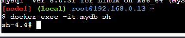

- Let's check the version number by running the same command again, only this time from within the new shell session in the container.

    ```.term1
    mysql --user=root --password=$MYSQL_ROOT_PASSWORD --version
    ```

- Notice the output is the same as before.

    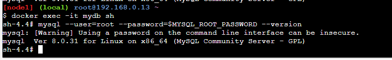

- Type `exit` to leave the interactive shell session.

    ```.term1
    exit
    ```

## Package and run a custom app using Docker and Dockerfile


use the following git command to clone this repository containing sample application which we will dockerize 

```
git clone https://github.com/dockersamples/linux_tweet_app
```

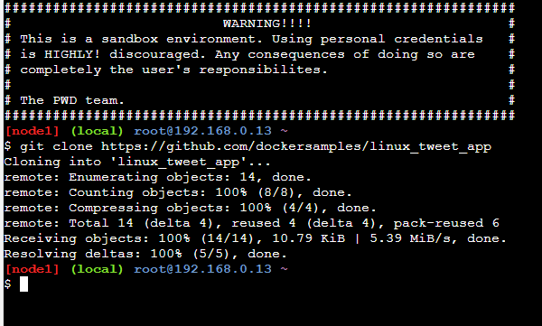


- In this step you'll learn how to package your own apps as Docker images using a [Dockerfile](https://docs.docker.com/engine/reference/builder/).

- The Dockerfile syntax is straightforward. 
- In this task, we're going to create a simple NGINX website from a Dockerfile.

### Build a simple website image

- Let's have a look at the  Dockerfile we'll be using, which builds a simple website that allows you to send a tweet.

-  Make sure you're in the `linux_tweet_app` directory.

    ```.term1
    cd ~/linux_tweet_app
    ```


- Display the contents of the Dockerfile.

    ```.term1
    cat Dockerfile
    ```


- Let's see what each of these lines in the Dockerfile do.

    - [FROM](https://docs.docker.com/engine/reference/builder/#from) specifies the base image to use as the starting point for this new image you're creating. For this example we're starting from `nginx:latest`.
    - [COPY](https://docs.docker.com/engine/reference/builder/#copy) copies files from the Docker host into the image, at a known location. In this example, `COPY` is used to copy two files into the image: `index.html`. and a graphic that will be used on our webpage.
    - [EXPOSE](https://docs.docker.com/engine/reference/builder/#expose) documents which ports the application uses.
    - [CMD](https://docs.docker.com/engine/reference/builder/#cmd) specifies what command to run when a container is started from the image. Notice that we can specify the command, as well as run-time arguments.

- In order to make the following commands more copy/paste friendly
- export an environment variable containing your DockerID (if you don't have a DockerID you can get one for free via [Docker Hub](https://hub.docker.com)).

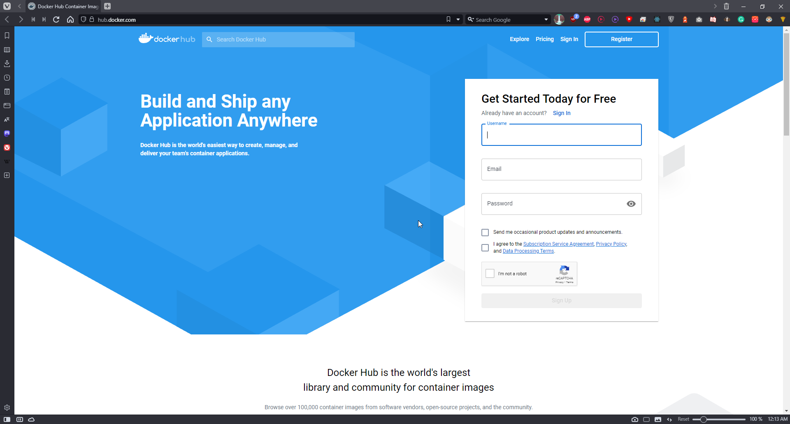

copy your docker ID

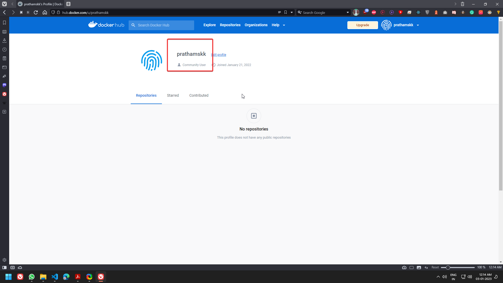

- You will have to manually type this command as it requires your unique DockerID.

    `export DOCKERID=<your docker id>`

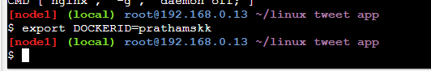

4. Echo the value of the variable back to the terminal to ensure it was stored correctly.

    ```.term1
    echo $DOCKERID
    ```

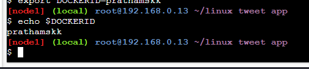

5. Use the `docker image build` command to create a new Docker image using the instructions in the Dockerfile.

    * `--tag` allows us to give the image a custom name. In this case it's comprised of our DockerID, the application name, and a version. Having the Docker ID attached to the name will allow us to store it on Docker Hub in a later step
    * `.` tells Docker to use the current directory as the build context

    Be sure to include period (`.`) at the end of the command.

    ```.term1
    docker image build --tag $DOCKERID/linux_tweet_app:1.0 .
    ```

    The output below shows the Docker daemon executing each line in the Dockerfile

   


6. Use the `docker container run` command to start a new container from the image you created.

    As this container will be running an NGINX web server, we'll use the `--publish` flag to publish port 80 inside the container onto port 80 on the host. This will allow traffic coming in to the Docker host on port 80 to be directed to port 80 in the container. The format of the `--publish` flag is `host_port`:`container_port`.

    ```.term1
    docker container run \
    --detach \
    --publish 80:80 \
    --name linux_tweet_app \
    $DOCKERID/linux_tweet_app:1.0
    ```
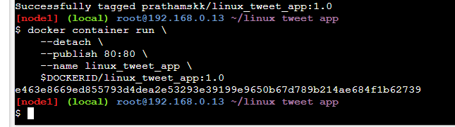

- Any external traffic coming into the server on port 80 will now be directed into the container on port 80.

- In a later step you will see how to map traffic from two different ports - this is necessary when two containers use the same port to communicate since you can only expose the port once on the host.  

7. Click the 80 Button to open the website you deployed


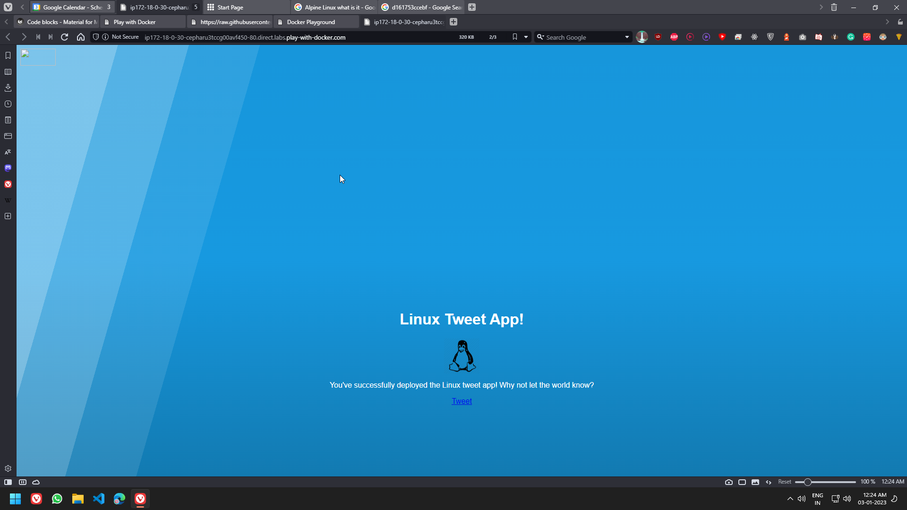

8. Once you've accessed your website, shut it down and remove it.

    ```.term1
    docker container rm --force linux_tweet_app
    ```


> **Note:** We used the `--force` parameter to remove the running container without shutting it down. This will ungracefully shutdown the container and permanently remove it from the Docker host.
>
> In a production environment you may want to use `docker container stop` to gracefully stop the container and leave it on the host. You can then use `docker container rm` to permanently remove it.

<!-- 
## <a name="Task_3"></a>Task 3: Modify a running website

When you're actively working on an application it is inconvenient to have to stop the container, rebuild the image, and run a new version every time you make a change to your source code.

One way to streamline this process is to mount the source code directory on the local machine into the running container. This will allow any changes made to the files on the host to be immediately reflected in the container.

We do this using something called a [bind mount](https://docs.docker.com/engine/admin/volumes/bind-mounts/).

When you use a bind mount, a file or directory on the host machine is mounted into a container running on the same host.

### Start our web app with a bind mount

1. Let's start the web app and mount the current directory into the container.

    In this example we'll use the `--mount` flag to mount the current directory on the host into `/usr/share/nginx/html` inside the container.

    Be sure to run this command from within the `linux_tweet_app` directory on your Docker host.

    ```.term1
    docker container run \
    --detach \
    --publish 80:80 \
    --name linux_tweet_app \
    --mount type=bind,source="$(pwd)",target=/usr/share/nginx/html \
    $DOCKERID/linux_tweet_app:1.0
    ```

    > Remember from the Dockerfile, `/usr/share/nginx/html` is where the html files are stored for the web app.

2. The [website](/){:data-term=".term1"}{:data-port="80"} should be running.

### Modify the running website

Bind mounts mean that any changes made to the local file system are immediately reflected in the running container.

1. Copy a new `index.html` into the container.

    The Git repo that you pulled earlier contains several different versions of an index.html file. You can manually run an `ls` command from within the `~/linux_tweet_app` directory to see a list of them. In this step we'll replace `index.html` with `index-new.html`.

    ```.term1
    cp index-new.html index.html
    ```

2. Go to the running [website](/){:data-term=".term1"}{:data-port="80"} and **refresh the page**. Notice that the site has changed.

    > If you are comfortable with `vi` you can use it to load the local `index.html` file and make additional changes. Those too would be reflected when you reload the webpage.
    > If you are really adventurous, why not try using `exec` to access the running container and modify the files stored there.

Even though we've modified the `index.html` local filesystem and seen it reflected in the running container, we've not actually changed the Docker image that the container was started from.

To show this, stop the current container and re-run the `1.0` image without a bind mount.

1. Stop and remove the currently running container.

    ```.term1
    docker rm --force linux_tweet_app
    ```

2. Rerun the current version without a bind mount.

    ```.term1
    docker container run \
    --detach \
    --publish 80:80 \
    --name linux_tweet_app \
    $DOCKERID/linux_tweet_app:1.0
    ```

3.  Notice  the [website](/){:data-term=".term1"}{:data-port="80"} is back to the original version.

4.  Stop and remove the current container

    ```.term1
    docker rm --force linux_tweet_app
    ```

### Update the image

To persist the changes you made to the `index.html` file into the image, you need to build a new version of the image.

1. Build a new image and tag it as `2.0`

    Remember that you previously modified the `index.html` file on the Docker hosts local filesystem. This means that running another `docker image build` command will build a new image with the updated `index.html`

    Be sure to include the period (`.`) at the end of the command.

    ```.term1
    docker image build --tag $DOCKERID/linux_tweet_app:2.0 .
    ```

    Notice how fast that built! This is because Docker only modified the portion of the image that changed vs. rebuilding the whole image.

2. Let's look at the images on the system.

    ```.term1
    docker image ls
    ```

    You now have both versions of the web app on your host.

    ```
    REPOSITORY                     TAG                 IMAGE ID            CREATED             SIZE
    <docker id>/linux_tweet_app    2.0                 01612e05312b        16 seconds ago      108MB
    <docker id>/linux_tweet_app    1.0                 bb32b5783cd3        4 minutes ago       108MB
    mysql                          latest              b4e78b89bcf3        2 weeks ago         412MB
    ubuntu                         latest              2d696327ab2e        2 weeks ago         122MB
    nginx                          latest              da5939581ac8        3 weeks ago         108MB
    alpine                         latest              76da55c8019d        3 weeks ago         3.97MB
    ```


### Test the new version

1. Run a new container from the new version of the image.

    ```.term1
    docker container run \
    --detach \
    --publish 80:80 \
    --name linux_tweet_app \
    $DOCKERID/linux_tweet_app:2.0
    ```

2. Check the new version of the [website](/){:data-term=".term1"}{:data-port="80"} (**You may need to refresh your browser to get the new version to load**).

    The web page will have an orange background.

    We can run both versions side by side. The only thing we need to be aware of is that we cannot have two containers using port 80 on the same host.

    As we're already using port 80 for the container running from the `2.0` version of the image, we will start a new container and publish it on port 8080. Additionally, we need to give our container a unique name (`old_linux_tweet_app`)

3. Run another new container, this time from the old version of the image.

    Notice that this command maps the new container to port 8080 on the host. This is because two containers cannot map to the same port on a single Docker host.

    ```.term1
    docker container run \
    --detach \
    --publish 8080:80 \
    --name old_linux_tweet_app \
    $DOCKERID/linux_tweet_app:1.0
    ```

4. View the old version of the [website](/){:data-term=".term1"}{:data-port="8080"}.

### Push your images to Docker Hub

1. List the images on your Docker host.

    ```.term1
    docker image ls -f reference="$DOCKERID/*"
    ```

    You will see that you now have two `linux_tweet_app` images - one tagged as `1.0` and the other as `2.0`.

    ```
    REPOSITORY                     TAG                 IMAGE ID            CREATED             SIZE
    <docker id>/linux_tweet_app    2.0                 01612e05312b        3 minutes ago       108MB
    <docker id>/linux_tweet_app    1.0                 bb32b5783cd3        7 minutes ago       108MB
    ```

    These images are only stored in your Docker hosts local repository. Your Docker host will be deleted after the workshop. In this step we'll push the images to a public repository so you can run them from any Linux machine with Docker.

    Distribution is built into the Docker platform. You can build images locally and push them to a public or private [registry](https://docs.docker.com/registry/), making them available to other users. Anyone with access can pull that image and run a container from it. The behavior of the app in the container will be the same for everyone, because the image contains the fully-configured app - the only requirements to run it are Linux and Docker.

    [Docker Hub](https://hub.docker.com) is the default public registry for Docker images.

2. Before you can push your images, you will need to log into Docker Hub.

    ```.term1
    docker login
    ```

    You will need to supply your Docker ID credentials when prompted.

    ```
    Username: <your docker id>
    Password: <your docker id password>
    Login Succeeded
    ```

3. Push version `1.0` of your web app using `docker image push`.

    ```.term1
    docker image push $DOCKERID/linux_tweet_app:1.0
    ```

    You'll see the progress as the image is pushed up to Docker Hub.

    ```
    The push refers to a repository [docker.io/<your docker id>/linux_tweet_app]
    910e84bcef7a: Pushed
    1dee161c8ba4: Pushed
    110566462efa: Pushed
    305e2b6ef454: Pushed
    24e065a5f328: Pushed
    1.0: digest: sha256:51e937ec18c7757879722f15fa1044cbfbf2f6b7eaeeb578c7c352baba9aa6dc size: 1363
    ```
4. Now push version `2.0`.

    ```.term1
    docker image push $DOCKERID/linux_tweet_app:2.0
    ```

    Notice that several lines of the output say `Layer already exists`. This is because Docker will leverage read-only layers that are the same as any previously uploaded image layers.

    ```
    The push refers to a repository [docker.io/<your docker id>/linux_tweet_app]
    0b171f8fbe22: Pushed
    70d38c767c00: Pushed
    110566462efa: Layer already exists
    305e2b6ef454: Layer already exists
    24e065a5f328: Layer already exists
    2.0: digest: sha256:7c51f77f90b81e5a598a13f129c95543172bae8f5850537225eae0c78e4f3add size: 1363
    ```

You can browse to `https://hub.docker.com/r/<your docker id>/` and see your newly-pushed Docker images. These are public repositories, so anyone can pull the image - you don't even need a Docker ID to pull public images. Docker Hub also supports private repositories.


##
### Make sure you have a DockerID

If you do not have a DockerID (a free login used to access Docker Hub), please visit [Docker Hub](https://hub.docker.com) and register for one. You will need this for later steps. -->