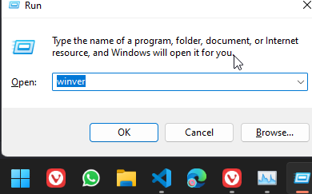
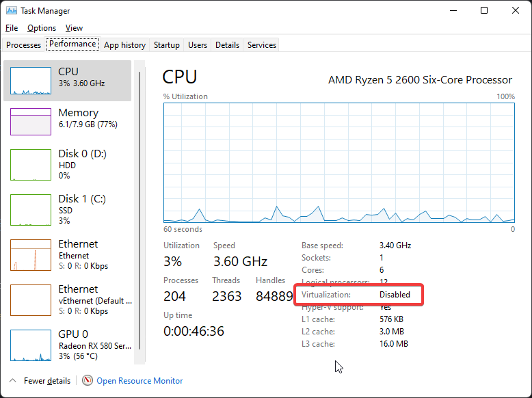
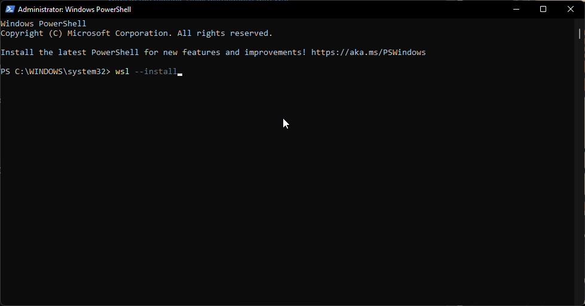
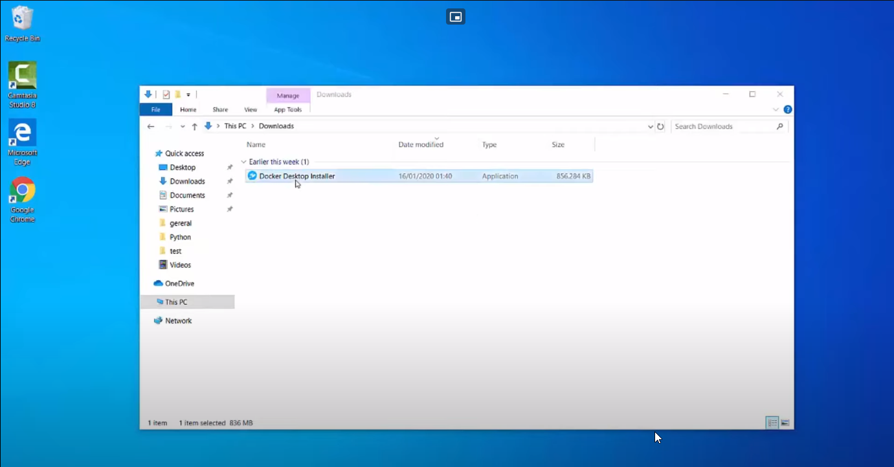
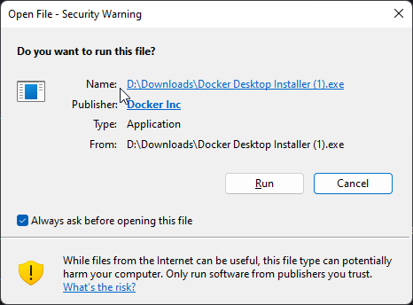
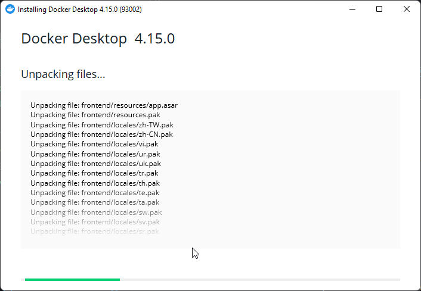
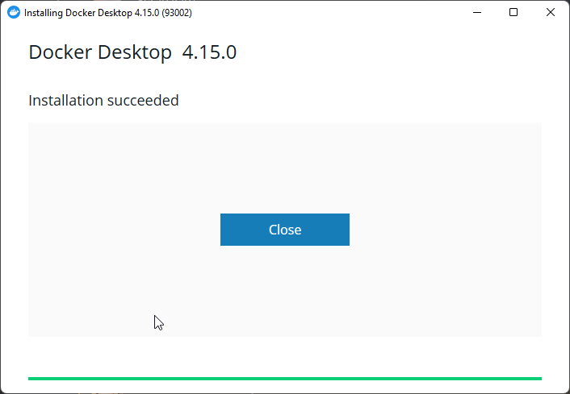
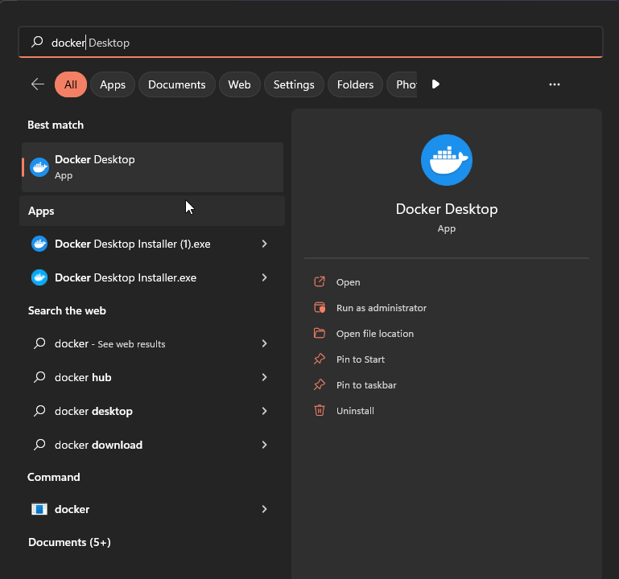

# Docker Installation Guide

!!! note

    This guide is for windows. 

## System Requirements

### Windows Version
WSL 2 backend

- Windows 11 64-bit: Home or Pro version 21H2 or higher, or Enterprise or Education version 21H2 or higher.
- Windows 10 64-bit: Home or Pro 21H1 (build 19043) or higher, or Enterprise or Education 20H2 (build 19042) or higher.

#### Steps to Check Windows Version

Press `win + r` to open Run

Type `winver` and press `Ok`

### BIOS-level hardware virtualization

BIOS-level hardware virtualization support must be enabled in the BIOS settings. 

#### Steps to Check if BIOS-level hardware virtualization is enabled

Open Task Manager

!!! tip

    Shortcut to open Task Manager is `ctrl + shift + esc` 

Go to Performance Tab and Check if virtualization is Disabled or enabled

To enable BIOS-level hardware virtualization on your computer, you will need to follow the specific instructions provided by the manufacturer of your motherboard and CPU.  

These instructions can usually be found by searching online or consulting the documentation that came with your hardware. It is important to follow these instructions carefully to ensure that the virtualization feature is properly enabled and that your system is set up correctly.

!!! example

    For Gigabyte B450M motherboard with AMD Ryzen 5 2600 CPU
    

### WSL 2

Enable the WSL 2 feature on Windows.  
The following hardware prerequisites are required to successfully run WSL 2 on Windows 10 or Windows 11:

- 64-bit processor with Second Level Address Translation (SLAT)
- 4GB system RAM

#### Steps to Enable WSL 2

Start powershell as admin

Run the command in the powershell to install WSL 2

    wsl --install

## Downloading and installing Docker

Start with downloading docker.exe installer 

Link to download : [https://www.docker.com](https://www.docker.com){:target="_blank"}

Double-click Docker Desktop Installer.exe to run the installer.

Click Run

Leave the default configuration as it is and click ok

Wait till Docker finishes installing

Open Docker

Accept the terms and service

After waiting for docker to start this screen will open

!!! Failure

    If Hardware Level BIOS Virtualization is not enabled the following error will be displayed when starting docker  
    [Find out how to enable Hardware Level BIOS Virtualization](installation.md#steps-to-check-if-bios-level-hardware-virtualization-is-enabled)

    

